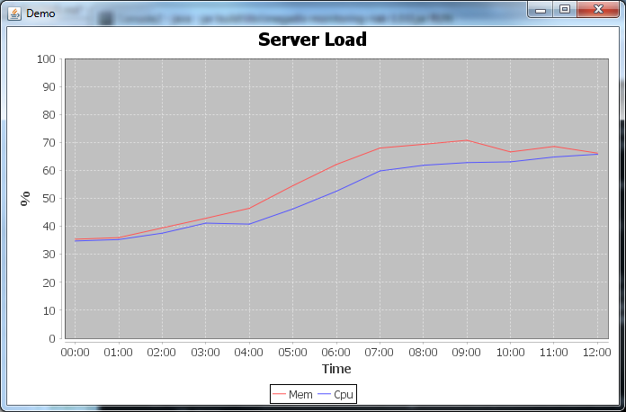

# Server monitoring using Riak as backend

This project is part of my Bachelor's Degree work:

*"Comparative Analysis of NoSQL Databases and Applications"*  
Università degli Studi di Milano-Bicocca

Relator: Andrea Maurino  
Co-relator: Blerina Spahiu

# Tutorial

## Prerequisites

- Java 1.7 or newer
- Riak 1.4 or newer

## Build from source

### Download code

You can either:

- **download** directly a tar/zip of *master* branch from GitHub repository:  
https://github.com/megadix/server_monitoring_riak/archive/master.zip
- **clone the repository**:  
git@github.com:megadix/server_monitoring_riak.git

### Configure Riak

To test this prototype I highly suggest to [build Riak from sources](http://docs.basho.com/riak/latest/ops/building/installing/from-source/), as you can easily experiment with clusters and various configurations.

The examples use [Secondary Indexes (2i)](http://docs.basho.com/riak/latest/dev/using/2i/), so [eLevelDB storage engine](http://docs.basho.com/riak/latest/ops/advanced/backends/leveldb/) must be enabled.

To do this, open configuration file of your nodes:  
*/etc/app.config*

*(Note: this must be done on **all** your nodes, otherwise the cluster won't run properly!)*

Under ***{riak_kv}*** section, modifiy:

    {storage_backend, riak_kv_bitcask_backend}

to:

    {storage_backend, riak_kv_eleveldb_backend}

If you have any troubles with Riak configuration, consult [Official Riak Documentation](http://docs.basho.com/riak/latest/) as it provides excellent info on every aspect of Riak's administration and usage.

### Configure Project

Open:  
*src/main/resources/application.properties*

and edit the entries to match your Riak installation:

    monitorin.riak.pbcHost=192.168.56.102
    monitorin.riak.pbcPort=10017

### Build

Open a command line terminal in the root directory and issue this command:

On Windows:

    gradlew build

On Linux/Unix:

    chmod u+x gradlew
    ./gradlew build

***gradlew*** is the [Gradle Wrapper](http://www.gradle.org/docs/current/userguide/gradle_wrapper.html), a small script and library (under */gradle* sub-directory) that provides  the Gradle build system, so you don't have to install it on your machine.

    >gradlew build

    :compileJava
    :processResources
    :classes
    :jar
    :bootRepackage
    :assemble
    :compileTestJava UP-TO-DATE
    :processTestResources UP-TO-DATE
    :testClasses UP-TO-DATE
    :test UP-TO-DATE
    :check UP-TO-DATE
    :build

    BUILD SUCCESSFUL

    Total time: 11.744 secs

The build process creates a /build sub-directory containing all the artefacts.

## Setup test data

To create test data you must run the application in SETUP mode:

On Windows:

    java -jar build\libs\megadix-monitoring-riak-1.0.0.jar SETUP

On Linux/Unix:

    java -jar build/libs/megadix-monitoring-riak-1.0.0.jar SETUP

The output will be similar to this (cut for brevity):

      .   ____          _            __ _ _
     /\\ / ___'_ __ _ _(_)_ __  __ _ \ \ \ \
    ( ( )\___ | '_ | '_| | '_ \/ _` | \ \ \ \
     \\/  ___)| |_)| | | | | || (_| |  ) ) ) )
      '  |____| .__|_| |_|_| |_\__, | / / / /
     =========|_|==============|___/=/_/_/_/
     :: Spring Boot ::        (v1.1.5.RELEASE)

    2014-08-29 13:15:41.837  INFO 8924 --- [           main] monitoring.Application                   : Starting Application on dimitri-PC with PID 8924 (G:\progetti\dimitri\universita\stage e laurea\progetto\experiments\server_monitoring_riak\build\libs\megadix-monitoring-riak-1.0.0.jar started by dimitri in G:\progetti\dimitri\universita\stage e laurea\progetto\experiments\server_monitoring_riak)
    2014-08-29 13:15:42.194  INFO 8924 --- [           main] s.c.a.AnnotationConfigApplicationContext : Refreshing org.springframework.context.annotation.AnnotationConfigApplicationContext@5062d8c3: startup date [Fri Aug 29 13:15:42 CEST 2014]; root of context hierarchy
    2014-08-29 13:15:43.749  INFO 8924 --- [           main] o.s.j.e.a.AnnotationMBeanExporter        : Registering beans for JMX exposure on startup
    2014-08-29 13:27:34.439  INFO 8924 --- [           main] monitoring.Application                   : Created 100 objects
    2014-08-29 13:27:35.288  INFO 8924 --- [           main] monitoring.Application                   : Created 200 objects
    2014-08-29 13:27:36.078  INFO 8924 --- [           main] monitoring.Application                   : Created 300 objects
    2014-08-29 13:27:36.838  INFO 8924 --- [           main] monitoring.Application                   : Created 400 objects
	
	[...]
	
    2014-08-29 13:31:33.719  INFO 8924 --- [           main] monitoring.Application                   : Created 9900 objects
    2014-08-29 13:31:34.226  INFO 8924 --- [           main] monitoring.Application                   : Created 10000 objects
    2014-08-29 13:31:34.854  INFO 8924 --- [       Thread-2] s.c.a.AnnotationConfigApplicationContext : Closing org.springframework.context.annotation.AnnotationConfigApplicationContext@5062d8c3: startup date [Fri Aug 29 13:15:42 CEST 2014]; root of context hierarchy
    2014-08-29 13:31:34.856  INFO 8924 --- [       Thread-2] o.s.j.e.a.AnnotationMBeanExporter        : Unregistering JMX-exposed beans on shutdown

### Run example

To view and example data extraction, execute the application in RUN mode:

On Windows:

    java -jar build\libs\megadix-monitoring-riak-1.0.0.jar RUN

On Linux/Unix:

    java -jar build/libs/megadix-monitoring-riak-1.0.0.jar RUN

The application will extract data, process it, and display a window with a chart:

